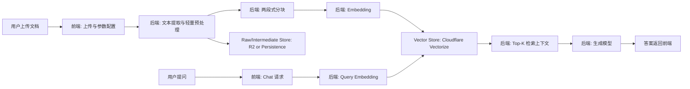

# DocVec_RAG

面向网页端轻量部署的 RAG（Retrieval-Augmented Generation）系统。

目标是把文档上传、知识库构建与检索问答整合到同一套前后端链路中，在资源受限场景下保持可用性能、可解释结果与可替换架构。

---

## 快速导航

- [项目概览](#项目概览)
- [核心能力与状态](#核心能力与状态)
- [架构流程图](#架构流程图)
- [运行时配置与安全边界](#运行时配置与安全边界)
- [仓库结构](#仓库结构)
- [本地启动](#本地启动)
- [接口地图](#接口地图)
- [质量与测试](#质量与测试)
- [路线图](#路线图)
- [参考文档](#参考文档)

---

## 项目概览

| 维度              | 说明                                         |
| ----------------- | -------------------------------------------- |
| 项目类型          | 文档驱动的 RAG Web 应用                      |
| 前端              | Vue 3 + 原生 JavaScript（静态页面形态）      |
| 后端              | Java Spring Boot（Maven 优先）               |
| 向量库基线        | Cloudflare Vectorize                         |
| 原文/中间文本存储 | Cloudflare R2 或后端持久层                   |
| 当前阶段          | 核心链路可跑通，生产级 Cloudflare 接入收口中 |

本项目坚持以下设计主线：

- 后端统一编排上传、预处理、分块、向量化、检索、生成。
- 前端专注交互体验、参数配置与会话级运行时配置。
- embedding 在索引与查询两侧强制同模型同维度。
- 能力分层明确，便于从占位实现平滑切换到生产实现。

---

## 核心能力与状态

| 能力模块                 | 当前状态 | 说明                                       |
| ------------------------ | -------- | ------------------------------------------ |
| 文档上传与文本提取链路   | 已具备   | 前端支持 PDF/DOCX/TXT 上传，后端接收并处理 |
| 两段式分块框架           | 已具备   | 固定长度粗切 + 语义策略收口                |
| embedding 一致性约束     | 已具备   | 构建与查询侧绑定同一模型与维度             |
| 模型路由（默认/回退）    | 已具备   | 支持 Workers AI 与 external 适配路由       |
| 存储回退与回补观测       | 已具备   | 提供 fallback 事件查询与 replay 接口       |
| 会话级运行时配置         | 已具备   | 通过会话头 + kbName 作用域应用配置         |
| Cloudflare 真实 API 接入 | 进行中   | Vectorize/R2/Workers AI 仍有占位实现待替换 |
| Docker/CI/端到端自动化   | 待完成   | 当前尚未形成完整生产流水线                 |

---

## 架构流程图



---

## 运行时配置与安全边界

### 前端能力

当前页面已提供“高级 API 配置（会话级）”区域，支持填写并应用：

- Cloudflare Account ID、API Token、Vectorize Index、Namespace、R2 Bucket。
- 生成模型 Provider、Base URL、API Key、Generation Model ID。
- 会话 ID 自动生成并通过 sessionStorage 保持。
- 配置按 kbName 快照隔离。

### 后端能力

后端已提供运行时配置接口：

- `POST /api/runtime-config/apply`
- `GET /api/runtime-config/current`

并通过请求头进行会话绑定：

- `X-Client-Session-Id`

### 安全约束

- 业务接口（upload/build/chat）不携带明文密钥字段。
- 密钥仅通过 runtime-config 通道输入。
- 读取配置时只返回脱敏摘要，不返回明文 Token/Key。

---

## 仓库结构

```text
DocVec_RAG/
├─ AGENTS.md
├─ ARCHITECTURE.md
├─ Prompt
├─ README.MD
├─ README.MD.bak
├─ backend/
│  ├─ pom.xml
│  ├─ mvnw
│  ├─ mvnw.cmd
│  └─ src/
│     ├─ main/
│     │  ├─ java/com/docvecrag/backend/
│     │  └─ resources/application.yml
│     └─ test/java/com/docvecrag/backend/
└─ frontend/
   ├─ index.html
   ├─ app.js
   └─ styles.css
```

---

## 本地启动

### 1. 后端启动

环境建议：

- JDK 17+
- 使用仓库内 Maven Wrapper

Windows PowerShell:

```powershell
cd backend
.\mvnw.cmd clean package
.\mvnw.cmd test
.\mvnw.cmd spring-boot:run
```

macOS/Linux:

```bash
cd backend
./mvnw clean package
./mvnw test
./mvnw spring-boot:run
```

默认端口：`8080`

### 2. 前端启动

前端为静态页面，可直接打开 [frontend/index.html](frontend/index.html)，或通过任意静态服务器托管 [frontend](frontend)。

默认后端地址：`http://localhost:8080/api`

---

## 接口地图

### 核心业务接口

| 接口                             | 说明                               |
| -------------------------------- | ---------------------------------- |
| `POST /api/documents/upload`     | 文档上传与入库                     |
| `POST /api/knowledge-base/build` | 构建知识库（分块 + 向量化 + 索引） |
| `POST /api/chat`                 | 基于检索上下文生成回答             |

### 配置与运维接口

| 接口                                | 说明                     |
| ----------------------------------- | ------------------------ |
| `POST /api/runtime-config/apply`    | 应用会话级运行时配置     |
| `GET /api/runtime-config/current`   | 获取当前会话配置（脱敏） |
| `GET /api/storage/fallback/events`  | 查询存储回退事件         |
| `POST /api/storage/fallback/replay` | 触发回退数据回补         |
| `GET /api/models/routing/status`    | 查看模型路由与健康状态   |

完整字段契约与约束说明请查看 [backend/API_CONTRACT.md](backend/API_CONTRACT.md)。

---

## 质量与测试

当前测试基线：

- 后端可执行 Maven 测试与启动流程。

当前单测覆盖仍偏基础，建议补齐以下回归集：

- 上传 -> 构建 -> 聊天主链路测试。
- 运行时配置按 session + kbName 隔离测试。
- 存储回退与 replay 恢复测试。
- 模型路由默认/回退切换测试。

建议把发布门槛设为：

1. `mvnw test` 全绿。
2. 三条主链路冒烟通过（上传、构建、聊天）。
3. 运行时配置与密钥脱敏行为验证通过。

---

## 路线图

### 近期目标

1. 完成 Cloudflare 真实 API 接入（Vectorize + R2 + Workers AI）。
2. 保留占位实现为可切换降级路径，避免联调中断。
3. 补齐关键自动化测试与最小可观测指标。

### 中期目标

1. 增加 Docker Compose 与环境模板。
2. 建立 CI 流水线（编译、测试、检查、打包）。
3. 完成首个可审计生产版本基线。

---

## 参考文档

- 需求与产品目标: [Prompt](Prompt)
- 架构决策基线: [ARCHITECTURE.md](ARCHITECTURE.md)
- 后端接口契约: [backend/API_CONTRACT.md](backend/API_CONTRACT.md)
- 协作与约束规范: [AGENTS.md](AGENTS.md)

如果你准备继续推进生产接入，建议先从 Vectorize/R2 真实 API 替换开始，再收口模型服务与回归测试。
